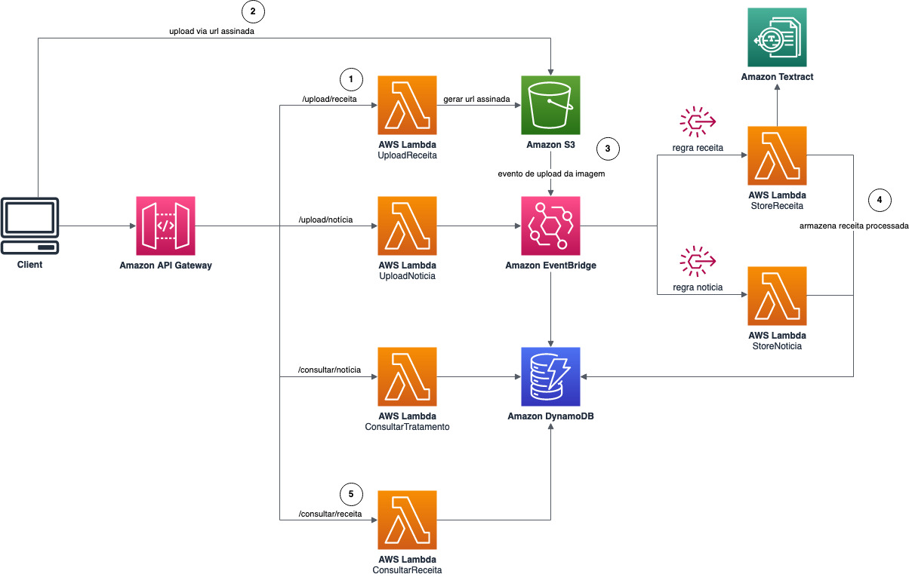

# AWS Event-Driven Architecture (EDA) SAM sample

## Architecture



## Getting Started

```bash
    sam init # start sam project
    sam build
    sam local invoke HelloWorldFunction --event events/hello_world_event.json
    sam local start-api
    sam deploy --stack-name aws-sam-python-example --resolve-s3 --capabilities CAPABILITY_IAM
    sam delete --stack-name aws-sam-python-example
```
